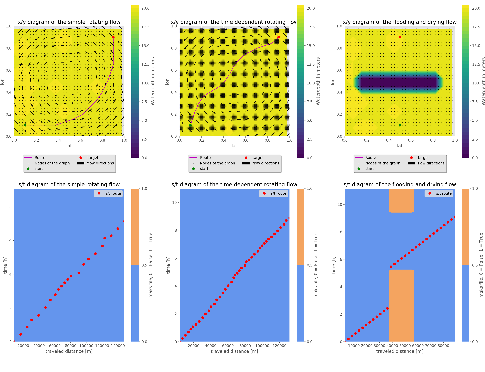

========
Examples
========

This page contains a few examples to help understand the software.

Explanation example
-------------------

The First example is a fictive Explanation example.In this example 
the shortest, fastest, cheapest, and least pollutant route is 
determind for a simple rotating flow with a random bathymetry. 

The First step is to load the dependencies.

.. code:: python3

The second step is to determine the hydrodynamic conditions. Since
this is a fictive case the hydrodynamic conditions are made up. 
For real use cases the output of a CFD model can be used. 

.. code:: python3

The third step is to describe the project parameters, and the vessel parameters. 

.. code:: python3

The Fourth step is to generate the Roadmap. This step is the pre-processing step.

.. code:: python3

4/4

The Fift step is the calculate the optimal shipping route. In this step the four routes are calculated. 

.. code:: python3

the computational time is: 14.31 sec

The last step is to plot the results. The results are according to the expectations. 

.. code:: python3

.. image:: Results1.PNG

Validation based on trival test cases
-------------------------------------

In this example the python code for the validation cases is displayed. 

Import the required libaries

.. code:: python3

Define the hydrodynamic conditions

.. code:: python3

Define the project parameters.

.. code:: python3

Define the Roadmaps

.. code:: python3

Plot the results:

.. code:: python3

Flow class for dd Zuno-v4 hirlam-kf (DCSMv6 zunov4)
--------------------------------------------------

Data available at

'http://noos.matroos.rws.nl'_ 

.. _http://noos.matroos.rws.nl: http://noos.matroos.rws.nl

With this class real hydrodynamic data can be used to optimize real shipping routes. 

.. code:: python3
