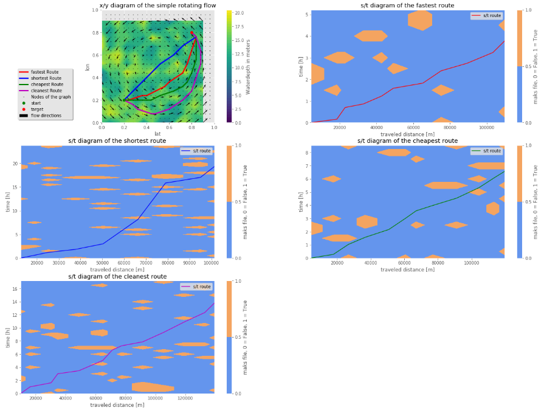

========
Examples
========

This page contains a few examples to help understand the software.

Explanation example
-------------------

The First example is a fictive Explanation example.In this example 
the shortest, fastest, cheapest, and least pollutant route is 
determind for a simple rotating flow with a random bathymetry. 

Load dependencies
~~~~~~~~~~~~~~~~~

The First step is to load the dependencies.

.. code:: python3
    from collections import defaultdict
    import math
    import numpy as np
    from numpy import ma
    import datetime, time
    from datetime import datetime
    import netCDF4
    from netCDF4 import Dataset, num2date
    from scipy.interpolate import griddata
    from scipy.spatial import Delaunay

    import halem
    import halem.Mesh_maker as Mesh_maker
    import halem.Functions as Functions
    import halem.Calc_path as Calc_path
    import halem.Flow_class as Flow_class

    import matplotlib.pyplot as plt
    plt.style.use('ggplot')
    % matplotlib inline

    import os
    from cartopy import config
    import cartopy.crs as ccrs
    import cartopy.feature as cfeature

Define Flow Class
~~~~~~~~~~~~~~~~~

The second step is to determine the hydrodynamic conditions. Since
this is a fictive case the hydrodynamic conditions are made up. 
For real use cases the output of a CFD model can be used. 

.. code:: python3
    class flow_potentiaalveld():
        def __init__(self, name):
            d = datetime.strptime("23/03/2019 00:00:00", "%d/%m/%Y %H:%M:%S")
            t0 = d.timestamp() 
            x = np.arange(0,1,0.04)
            y = np.arange(0,1,0.04)
            t = np.arange(t0, (t0+2*30*60*30),30*60)

            y, x = np.meshgrid(y, x)
            y = y.reshape(y.size)
            x = x.reshape(y.size)

            nodes = np.zeros((len(x),2))
            nodes[:,0] = y
            nodes[:,1] = x

            u = []
            v = []
            for node in nodes:
                ut = 0*t + 2 * np.cos(np.pi*(node[0]))
                vt = 0*t - 2 * np.cos(np.pi*(node[1]))
                u.append(ut)
                v.append(vt)

            self.v = np.transpose(np.array(v))
            self.u = np.transpose(np.array(u))
            self.WD = np.random.rand(self.u.shape[0],self.u.shape[1])*12 + 8
            #self.WD = self.u * 0 + 20
            self.t = t
            self.nodes = nodes
            self.tria = Delaunay(nodes)

    def compute_cost(week_rate, fuel_rate):
        second_rate = week_rate/7/24/60/60
        return lambda travel_time, speed: (travel_time*second_rate + fuel_rate*travel_time * speed**3)

    def compute_co2(fuel_rate):
        return lambda travel_time, speed: (fuel_rate*travel_time * speed**3)

Define project parameters 
~~~~~~~~~~~~~~~~~~~~~~~~~

The third step is to describe the project parameters, and the vessel parameters. 

.. code:: python3
    nl = (3,2.5)
    dx_min = 0.01
    blend = 1
    vship = np.array([[1,4,8],
                      [1,5,10]
                     ])
    WD_min = np.array([8,7])
    WPVI = np.array([4000, 10000])
    ukc = 1.5
    WWL = 40
    name_textfile_flow = 'maaktnietuit'
    Load_flow = flow_potentiaalveld
    number_of_neighbor_layers = 3

    Q_cost = compute_cost(700_000, 0.008)
    Q_co2 = compute_co2(1)

Generate the Roadmap
~~~~~~~~~~~~~~~~~~~~

This step is the pre-processing step.

.. code:: python3
    start_time = time.time()

    Roadmap_t = Mesh_maker.Graph_flow_model(name_textfile_flow, 
                                            dx_min, 
                                            blend, 
                                            nl, 
                                            number_of_neighbor_layers, 
                                            vship, 
                                            Load_flow, 
                                            WD_min,
                                            WPVI,
                                            WWL = WWL,
                                            ukc = ukc,
                                            compute_cost = Q_cost,
                                            compute_co2 = Q_co2,
                                           )

    #TomTom.save_object(Roadmap, name_textfile_save)

    stop_time = time.time()
    computation_time = stop_time - start_time
    print("the computational time is:", round(computation_time,2), "sec")

4/4
the computational time is: 448.21 sec

Calculate the optimal route
~~~~~~~~~~~~~~~~~~~~~~~~~~~

In this step the four routes are calculated. 

.. code:: python3
    t0 = "23/03/2019 03:00:00"          #Departure time

    start = (0.2, 0.2)
    stop = (0.8, 0.8)
    v_max = 7

    start_time = time.time()

    path_t, time_t, dist_t = halem.HALEM_time(start, stop, t0, v_max, Roadmap_t)
    path_s, time_s, dist_s = halem.HALEM_space(start, stop, t0, v_max, Roadmap_t)
    path_c, time_c, dist_c = halem.HALEM_cost(start, stop, t0, v_max, Roadmap_t)
    path_p, time_p, dist_p = halem.HALEM_co2(start, stop, t0, v_max, Roadmap_t)

    stop_time = time.time()
    computation_time = stop_time - start_time
    print("the computational time is:", round(computation_time,2), "sec")

the computational time is: 14.31 sec

Plot the results
~~~~~~~~~~~~~~~~

In this step the results are plotted. The results are according to the expectations. 

.. code:: python3
    fig = plt.figure(figsize=(23, 17))

    ax = plt.subplot(3,2,1)
    plt.axis('square')
    a = 1

    x_r = np.arange(0,1, 0.075)
    y_r = np.arange(0,1, 0.075)
    y_r, x_r = np.meshgrid(y_r,x_r)

    WD_r = griddata((Roadmap_t.nodes[:,1], Roadmap_t.nodes[:,0]), Roadmap_t.WD[:,0], (x_r, y_r), method= 'linear')
    u_r = griddata((Roadmap_t.nodes[:,1], Roadmap_t.nodes[:,0]), Roadmap_t.u[:,0], (x_r, y_r), method= 'linear')
    v_r = griddata((Roadmap_t.nodes[:,1], Roadmap_t.nodes[:,0]), Roadmap_t.v[:,0], (x_r, y_r), method= 'linear')

    cval = np.arange(0,21,0.5)
    im = plt.contourf(x_r,y_r,WD_r, cval)
    fig.colorbar(im, ax=ax, label = 'Waterdepth in meters')

    plt.quiver(x_r[::a,::a],
               y_r[::a,::a],
               u_r[::a,::a],
               v_r[::a,::a],
               label = 'flow directions'
              )
    plt.plot(path_t[:,0], path_t[:,1],'r', label = 'fastest Route', linewidth = 3)
    plt.plot(path_s[:,0], path_s[:,1],'b', label = 'shortest Route', linewidth = 3)
    plt.plot(path_c[:,0], path_c[:,1],'g', label = 'cheapest Route', linewidth = 3)
    plt.plot(path_p[:,0], path_p[:,1],'m', label = 'cleanest Route', linewidth = 3)

    plt.plot(Roadmap_t.nodes[:,1], Roadmap_t.nodes[:,0], 'k.', label = 'Nodes of the graph', markersize = 1)
    plt.plot(path_t[0, 0], path_t[0, 1], 'go', label = 'start')
    plt.plot(path_t[-1, 0 ], path_t[-1, 1], 'ro', label = 'target')

    plt.xlim(0,1)
    plt.ylim(0,1)
    plt.title(r'x/y diagram of the simple rotating flow')
    ax.legend(loc='upper center', bbox_to_anchor=(-0.5, 0.5),
              ncol=1, fancybox=True, shadow=True)
    plt.xlabel('lat')
    plt.ylabel('lon')

    plt.subplot(3,2,2)
    halem.plot_timeseries2(path_t, time_t, Roadmap_t, 'r')
    plt.title('s/t diagram of the fastest route')

    plt.subplot(3,2,3)
    halem.plot_timeseries2(path_s, time_s, Roadmap_t, 'b')
    plt.title('s/t diagram of the shortest route')

    plt.subplot(3,2,4)
    halem.plot_timeseries2(path_c, time_c, Roadmap_t, 'g')
    plt.title('s/t diagram of the cheapest route')

    plt.subplot(3,2,5)
    halem.plot_timeseries2(path_p, time_p, Roadmap_t, 'm')
    plt.title('s/t diagram of the cleanest route')

    plt.show()

	